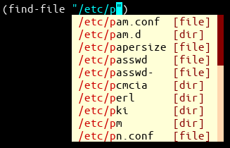

# company-dirfiles
company-dirfiles is an Emacs company-mode completion backend for file names.
It is a replacement for company-mode's default file name completion backend
(company-files).



company-dirfiles behaves much like Vim's filename completion
(`:help compl-filename`):
* Shows suggestions for one directory level only. Does not show suggestions from
  subdirectories. This avoids the long initial delay observed in company-mode's
  company-files when it looks into subdirectories for completion candidates.
* Directories in the suggestions list do not have trailing slashes.
* Typing the trailing slash on a directory name triggers suggestions of the
  directory's contents.
* Adds company-mode annotations to distinguish between files and directories.


## Requirements
* GNU Emacs 24.3 or later; and
* company-mode 0.9.3 or later.


## Installation
Add the `company-dirfiles/` directory to Emacs' load path:
```lisp
(add-to-list 'load-path "/path/to/company-dirfiles/")
```

Then, configure company-mode to use company-dirfiles instead of company-files:
```lisp
(setq company-backends (cons #'company-dirfiles
                             (delete #'company-files company-backends)))
```

Optional — you may also want to align annotations to the right:
```lisp
(setq company-tooltip-align-annotations t)
```


## Development
This package has been manually tested on:
* * GNU Emacs 26.3
  * company-mode 0.9.13
  * Ubuntu 20.04.1
* * GNU Emacs 24.3
  * company-mode 0.9.3
  * Windows 10

Project started on 2021-02-12.


## Credits
company-dirfiles.el is substantially based on [company-files.el][2] from
company mode 0.9.13 (released: 2020-07-26).
Nikolaj Schumacher is the author of company-files.el.


## License
The files in this project are licensed under the GNU General Public License,
version 3 or (at your option) any later version.


## Contributing
Bug reports, suggestions, and patches should be submitted on GitHub:
https://github.com/cwfoo/company-dirfiles


  [1]: https://github.com/company-mode/company-mode/issues/1064
  [2]: https://github.com/company-mode/company-mode/blob/0.9.13/company-files.el
